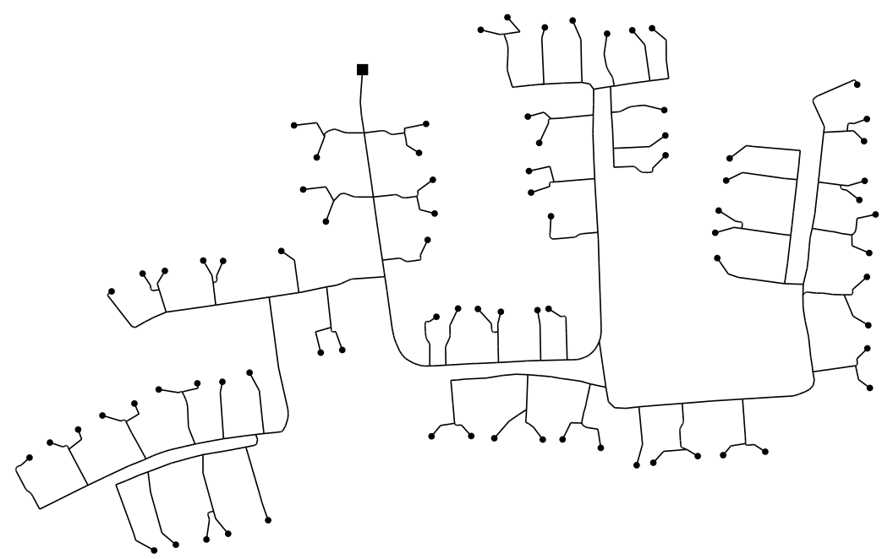

# MVLoDis: An open-source tool for disaggregating medium-voltage loads

Welcome to the homepage of MVLoDis, a MATLAB toolbox for disaggregating
medium-voltage (MV) loads into fully-modeled low-voltage networks (LVNs).

MVLoDis makes it possible to model power systems down to the household level,
creating networks in which each load&mdash;each air-conditioning unit, each PV
system, each electric water heater&mdash;is modelled individually. This level of
detail accurately captures the interaction of transmission and distribution
networks, thereby proving useful for stability studies that account for the
participation of small- and large-scale distributed energy resources (DERs).

## How the toolbox works

When disaggregating a given load, MVLoDis executes four steps in the following order:
1. **It identifies base templates**. These are realistic models of LVNs, which
should be (and in this work are) based on parameters of real networks. An
example is shown in the figure below. See [topology_creation](topology_creation)
for details.
2. **It allocates loads and DERs**. The toolbox choses possible loads and DERs
and allocates them randomly throughout the templates but following certain
statistical measures defined by the user. See
[disaggregation/README.md](disaggregation/README.md) and
[disaggregation/allocate_loads](disaggregation/allocate_loads) for details.
3. **It selects some templates**. After loads have been allocated throughout the
template, the toolbox choses a subset of them such that, when connected in
parallel, they consume about the same power as the load being disaggregated. See
[disaggregation/README.md](disaggregation/README.md) and
[disaggregation/choose_templates](disaggregation/choose_templates) for details.
4. **It connects the templates to the power system**. Once the optimal subset
has been found, MVLoDis enlarges slightly (optimally) the power consumed at each
load bus so that the LVNs have a total demand that is *exactly* the MV load
being disaggregated.

Initially, the toolbox was developed to disaggregate the HV-MV system produced
by TDNetGen [2]. However, the tool can be adapted to other systems. See
[examples/4_bus_system](examples/4_bus_system) for an example of the consecutive
disaggregation of a HV load into a MV network and of each MV load into LV
networks.

At the moment, the results are exported in the format required by RAMSES, an
academic, time-domain, dynamic simulation software [3]. However, since the core
functionality of the toolbox is implemented in MATLAB, similar subroutines can
be written to export the results in other formats. See
[exportation](exportation) for details on the exportation process.

## Authors

This project started at the University of Costa Rica as part of several studies
that involve the integration of DERs into the bulk power system. The authors of
this project are
* Francisco Escobar - *Core developer and maintainer* - [feprado04](https://gitlab.com/feprado04)
* Jorge García - *Contributor*
* Juan M. Víquez - *Contributor*
* Gustavo Valverde - *Contributor*
* Petros Aristidou - *Contributor*

Please send any questions or suggestions as an email to the author of this
repository.

## Bibliography

For further details on the methodology followed by the toolbox, please refer to

1. Escobar, F., García, J., Víquez, J. M., Valverde, G. & Aristidou, P.
(2020). *A Combined High-, Medium-, and Low-Voltage Test System for Stability
Studies with DERs* (in preparation).

For a documentation of the system that originally motivated the development of
MVLoDis, please refer to

2. Pilatte, N., Aristidou, P., & Hug, G. (2017). *TDNetGen: An open-source,
parametrizable, large-scale, transmission, and distribution test system.* IEEE
Systems Journal, 13(1), 729-737.

For more details on RAMSES, the software used for the dynamic simulations,
please refer to

3. Aristidou, P., Lebeau, S., & Van Cutsem, T. (2015). *Power system dynamic
simulations using a parallel two-level schur-complement decomposition.* IEEE
Transactions on Power Systems, 31(5), 3984-3995.

## License

This project is licensed under the MIT License. See the
[LICENSE](LICENSE) file for details.

## Future work

This toolbox is still a work in progress, with some functions being added as new
requirements arise. Here's a list of tasks under development or left for future
work:

* If a record of type `LOAD` is connected to a load bus, then the mismatch
impedance should be added to the power of that load, instead of adding another
record. This would relieve computational burden.

* The function `force_load()` should be able to place records of type other than
`LOAD` and it should be able to chose how close from the slack bus this record
is placed.

* Move the load-bus identifiers (currently variable `dummy_power`) to a single
file, similar to `parameters.m` but that need not be modified by the user. Do
something similar with the power precision and tolerances in the optimization
process, so that they can be computed from a user-given parameter that
specifies accuracy on a more top-level way.

* As part of the `preprocessing` folder, create a function that looks for
branches in parallel and combines them.

* Modify `disaggregate_load()` so that the toolbox can make parallel calls to
this function in order to speed up the disaggregation.

* Before the optimization, if the load being disaggregated is fed by a voltage
lower than 1 pu, exclude templates with low voltages.

* Allow the specification of mutually exclusive loads. An example are the
AIR_COND1 and AIR_COND2 records, which should not be connected to the same bus.

* Dump raw data concerning the tap changes for each network, as well as the
number of networks per MV load
