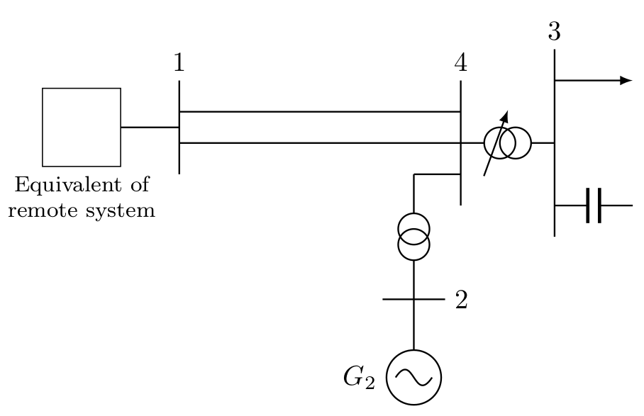
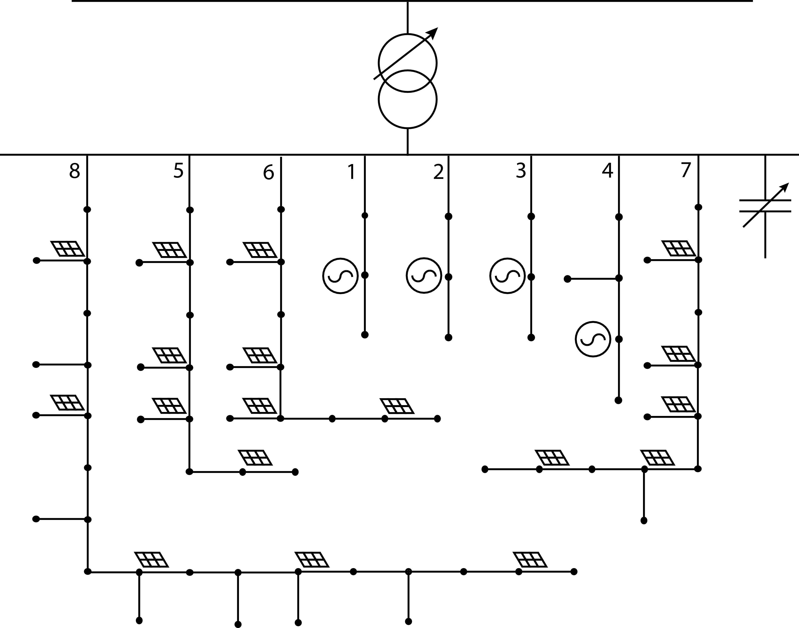

## Examples of load disaggregation with MVLoDis

This folder contains examples of load disaggregation using MVLoDis. The examples
are organized in subfolders, which contain MATLAB scripts to run the power
flow and the generated RAMSES files to run dynamic simulations.

### Four-bus system

The first example is the four-bus system from [1]. It consists of a transmission
system, a distribution system (subsystem on the right), and two identical
transmission lines that connect the two. The step-up transformer has a constant
transformation ratio, whereas the step-down transformer has an OLTC. The load
connected to bus 3, part of which will be disaggregated, is voltage-dependent.

The initial operating point is the one shown in the table. The columns PG and QG
correspond to generated active and reactive power, respectively, whereas PD and
QD correspond to demanded active and reactive power. All the values reported in
the table, as seen from the high- and medium-voltage buses, are preserved after
the disaggregation.

| Bus | V       (pu) | Angle (deg) | PG (MW) | QG (Mvar) | PD (MW) | QD (Mvar) |
| :-: | :----------: | :---------: | :-----: | :-------: | :-----: | :-------: |
|  1  | 1.080        |   0.000*    | 1200.00 | 421.28    |   -     |   -       |
|  2  | 1.010        | -14.792     |  300.00 | 194.73    |   -     |   -       |
|  3  | 1.021        | -20.851     |   -     |  -        | 1500.00 | 750.00    |
|  4  | 1.020        | -17.571     |   -     |  -        |   -     |   -       |
|     |              | Total:      | 1500.00 | 616.01    | 1500.00 | 750.00    |

The disaggregation of this system is carried out in two steps (which means that
the function ``disaggregate_load()`` is called consecutively twice):

1. **Replacing bus 3 by a MV network**. This requires getting rid of bus 3 and
the transformer that connects it to bus 4 and place instead an entire MV
network. Although this implies disaggregating a *high-voltage* load, the
disaggregation problem is essentially the same as disaggregating a *medium-voltage* load,
which means that ``disaggregate_load()`` does the job. In this case, the 75-bus
network from https://github.com/sedg/ukgds, whose one-line diagram is shown in
the figure below, is the only network included in the template set. Although PV
systems are shown in the diagram, they are deleted from the template for the
purposes of this problem.

2. **Replacing each MV bus by LVNs**. Each of the 74 load buses is disaggregated
into (possibly) several LVNs. These LVNs are, for this example, taken from
[../topology_creation/README.md](../topology_creation/README.md).

The resulting files can be found in
[./4_bus_system/output](./4_bus_system/output) with the names ``lm.dat`` and
``lv.dat``.

### References

1. Van Cutsem, T. and Vournas, C. (2007). *Voltage stability of electric power systems.* Springer Science & Business Media.
