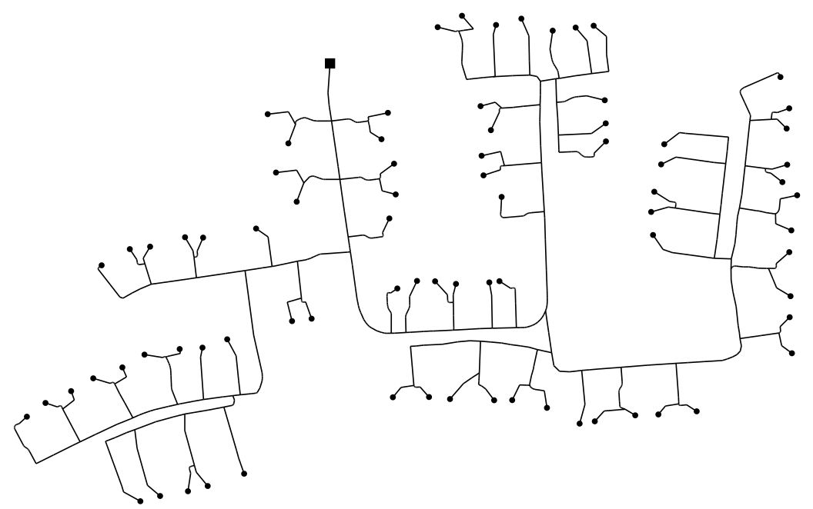

## Topology creation

This subfolder of the MVLoDis toolbox makes it possible to import a set of
predefined low-voltage networks (LVNs). The topologies are read from the OpenDSS
files located in [OpenDSS_data](OpenDSS_data) and are stored as MATPOWER cases
in [../disaggregation/created_topologies](../disaggregation/created_topologies).

There are 14 default LVN topologies, taken from [1].
The following figure shows one of the default topologies, which consists of 79
load buses, identified by circles, and one feeder, identified by a square. It
should be pointed out that only the topologies are imported, which means that no
meaningful load allocation takes place. Though some buses do have a placeholder
power consuption of 1 kW, the sole purpose of this power is to identify load
buses from transit buses.

### Building the topologies

1. In the file ``parameters.m``, change the parameters ``kVA``, ``R``, and
``X``. These are vectors with possible values for the kVA rating, resistance,
and leakage impedance of the step-down transformer. The tool will then choose
values at random from these vectors in order to model the step-down transformer
of each LVN.

2. Run ``main.m``.

3. In
[../disaggregation/created_topologies](../disaggregation/created_topologies),
find the ``.mat`` files that contain the LVN topologies. Each ``.mat`` file
contains a single MATPOWER case stored in a variable called ``mpc``.

### References

1. Fennan, C. (2018). *Creation of a generic test case for combined simulations
of medium and low voltage networks.* Swiss Federal Institute of Technology (ETH)
in Zurich, Semester thesis.
